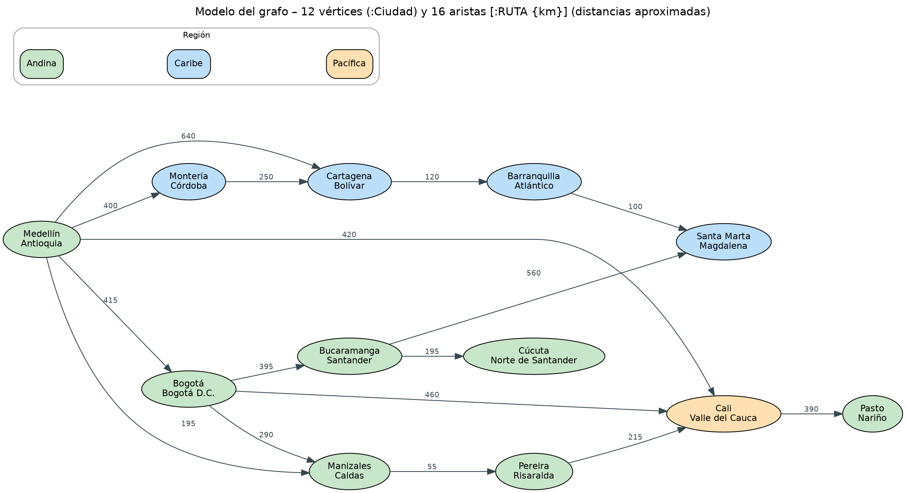

# AWS Data Services Lab

### Gestión de secretos, infraestructura como código y bases de datos administradas en AWS
*Proyecto académico — Ingeniería de Datos, Universidad EIA (2026-2)*


Este repositorio reúne seis prácticas sobre servicios de datos en Amazon Web Services. Cada una despliega un servicio con la configuración de menor costo posible, lo conecta desde un programa en Python y documenta su arquitectura, seguridad, costos y eliminación. El hilo conductor es **no escribir credenciales en el código**: las contraseñas de bases de datos se administran con **AWS Secrets Manager** y los servicios que no usan contraseña se autentican con **IAM**.

---

## Tabla de contenido

- [Alcance](#alcance)
- [Estructura del repositorio](#estructura-del-repositorio)
- [Requisitos previos](#requisitos-previos)
- [Modelo de seguridad y autenticación](#modelo-de-seguridad-y-autenticación)
- [Punto 1 — AWS Secrets Manager](#punto-1--aws-secrets-manager)
- [Punto 2 — Despliegue con Terraform, Boto3 y AWS CLI](#punto-2--despliegue-con-terraform-boto3-y-aws-cli)
- [Punto 3 — Amazon DocumentDB](#punto-3--amazon-documentdb)
- [Punto 4 — Amazon Neptune](#punto-4--amazon-neptune)
- [Punto 5 — Amazon Redshift](#punto-5--amazon-redshift)
- [Punto 6 — AWS Glue Data Catalog y Amazon Athena](#punto-6--aws-glue-data-catalog-y-amazon-athena)
- [Resumen de costos](#resumen-de-costos)
- [Limpieza de recursos](#limpieza-de-recursos)
- [Tecnologías](#tecnologías)
- [Contexto académico](#contexto-académico)

---

## Alcance

| Punto | Servicio | Qué se demuestra | Acceso desde local |
|:---:|---|---|---|
| 1 | AWS Secrets Manager | Crear, recuperar y actualizar un secreto con mínimo privilegio | Boto3 + perfil IAM |
| 2 | S3, EC2, RDS, VPC | Mismo despliegue con Terraform, Boto3 y AWS CLI; contraseña de RDS administrada | Usuario IAM `user_cli` |
| 3 | Amazon DocumentDB | Clúster Serverless, túnel SSH, TLS, consultas con PyMongo | Túnel SSH vía EC2 |
| 4 | Amazon Neptune | Grafo de propiedades con openCypher, recorridos desde Python | Punto de acceso público + IAM (SigV4) |
| 5 | Amazon Redshift | Carga con `COPY` desde S3 y consultas analíticas con la Data API | Redshift Data API |
| 6 | AWS Glue + Athena | Descubrimiento de esquema con crawler y consultas SQL sobre S3 | Consola / permisos IAM |

Todos los recursos se desplegaron en una sola región, **us-east-2 (Ohio)**, y se eliminaron al terminar cada práctica.

---

## Estructura del repositorio

```
.
├── README.md
├── .gitignore
│
├── punto1_secrets_manager/
│   ├── leer_secreto.py                 # Lectura del secreto con Boto3
│   └── politica_lector_secreto.json    # Política IAM de solo lectura sobre un secreto
│
├── punto2_terraform_sdk_cli/
│   ├── terraform/                      # main.tf, variables.tf, outputs.tf
│   ├── boto3/                          # Despliegue y eliminación con el SDK
│   ├── cli/                            # Comandos de AWS CLI
│   └── politica_user_cli.json          # Permisos mínimos del usuario user_cli
│
├── punto3_documentdb/
│   ├── documentdb_tienda.py            # Inserción, filtro, ordenación y agregación
│   ├── politica_app_docdb.json         # Lectura del secreto administrado del clúster
│   ├── global-bundle.pem               # Certificado público de AWS para TLS
│   └── diagrama_conexion_documentdb.png
│
├── punto4_neptune/
│   ├── neptune_rutas.py                # Creación del grafo y consultas de recorrido
│   ├── politica_app_neptune.json       # Acceso a datos del clúster vía IAM
│   ├── modelo_grafo_neptune.png
│   └── arquitectura_acceso_neptune.png
│
├── punto5_redshift/
│   ├── datos/                          # Tablas relacionadas en CSV
│   ├── redshift_carga_consultas.py     # S3 → COPY → consultas con la Data API
│   └── consultas.sql
│
└── punto6_glue/
    ├── datos/                          # Archivo con 20+ registros cargado a S3
    └── consultas_athena.sql
```

> Las evidencias de creación, prueba y eliminación de recursos (capturas de pantalla) se presentan en el informe de la actividad y no se versionan en este repositorio. En ellas se ocultaron el número de cuenta, las direcciones IP y cualquier valor sensible.

---

## Requisitos previos

| Herramienta | Uso |
|---|---|
| Windows 11 + WSL2 (Ubuntu) | Entorno de trabajo |
| AWS CLI v2 | Operaciones desde terminal y validación de identidades |
| Conda (entorno `aws-taller`, Python 3.11) | Ejecución de los programas |
| Terraform | Infraestructura como código (Punto 2) |
| MongoDB Compass | Cliente gráfico de DocumentDB (Punto 3) |
| Cuenta de AWS con un usuario administrador IAM | Creación de recursos (nunca con la cuenta raíz) |

### Instalación del entorno

```bash
# AWS CLI v2
curl "https://awscli.amazonaws.com/awscli-exe-linux-x86_64.zip" -o "awscliv2.zip"
unzip awscliv2.zip && sudo ./aws/install
aws --version

# Entorno de Python
conda create -n aws-taller python=3.11 -y
conda activate aws-taller
pip install boto3 pymongo
```

### Perfiles de AWS CLI

Cada programa usa su propio perfil con permisos mínimos. Los perfiles se configuran localmente y sus llaves quedan en `~/.aws/credentials`, **fuera del repositorio**:

```bash
aws configure --profile <nombre-del-perfil>
aws sts get-caller-identity --profile <nombre-del-perfil>
```

| Perfil | Usuario IAM | Permisos |
|---|---|---|
| `lector-secreto` | `app_lector_secreto` | `secretsmanager:GetSecretValue` sobre un único secreto |
| `user_cli` | `user_cli` | Crear y eliminar S3, EC2, RDS y red (Punto 2) |
| `app-docdb` | `app_docdb` | `secretsmanager:GetSecretValue` sobre el secreto del clúster DocumentDB |
| `app-neptune` | `app_neptune` | `neptune-db:*` de datos sobre un único clúster Neptune |

La creación y eliminación de la infraestructura de los puntos 3 a 6 se hizo desde **AWS CloudShell** con un usuario administrador IAM, de modo que ninguna llave con privilegios elevados quedó guardada en el equipo local.

---

## Modelo de seguridad y autenticación

| Principio | Cómo se aplicó |
|---|---|
| Sin contraseñas en el código | Los programas recuperan las credenciales de Secrets Manager en tiempo de ejecución. |
| Administración integrada | RDS y DocumentDB se crearon con contraseña administrada por Secrets Manager (`--manage-master-user-password`). |
| Mínimo privilegio | Cada programa usa un usuario IAM cuya política solo permite la acción necesaria sobre el recurso exacto (ARN específico). |
| Llaves IAM fuera de Secrets Manager | Las herramientas necesitan autenticarse en AWS **antes** de leer un secreto; las llaves de acceso viven en perfiles locales. |
| Servicios sin contraseña | Neptune, Glue y Athena se autentican solo con IAM; por eso no se creó ningún secreto para ellos. |
| Red restringida | Los grupos de seguridad solo admiten la IP pública del equipo (`/32`) o el grupo de seguridad de otro recurso. |
| Cifrado en tránsito | DocumentDB con TLS y certificado `global-bundle.pem`; Neptune con HTTPS y firma SigV4. |

### Archivos que nunca se publican

El `.gitignore` excluye estado de Terraform, llaves privadas y credenciales:

```gitignore
.terraform/
*.tfstate
*.tfstate.*
*.tfvars
*.pem
*.key
.env
credentials
```

> El archivo `global-bundle.pem` del Punto 3 es la excepción deliberada: es el certificado **público** de las autoridades de AWS y se versiona para poder reproducir la conexión TLS. Las llaves privadas `.pem` de EC2 se guardan en `~/.ssh` con permisos `400` y nunca entran al repositorio.

---

## Punto 1 — AWS Secrets Manager

**Objetivo:** guardar un usuario y una contraseña ficticios en Secrets Manager, leerlos desde Python con un usuario que solo puede acceder a ese secreto, y comprobar que una actualización del valor se refleja sin cambiar el código.

**Flujo**

1. Crear el secreto `taller-aws/punto1/credenciales-prueba` con las claves `username` y `password`, cifrado con la llave administrada `aws/secretsmanager`.
2. Crear el usuario IAM `app_lector_secreto` con la política [`politica_lector_secreto.json`](./punto1_secrets_manager/politica_lector_secreto.json), que solo permite `secretsmanager:GetSecretValue` sobre el ARN del secreto.
3. Ejecutar el programa:

```bash
cd punto1_secrets_manager
python leer_secreto.py
```

4. Actualizar el valor del secreto y volver a ejecutar el programa sin modificarlo.

**Resultado:** el programa muestra un `VersionId` distinto y el nuevo usuario. Secrets Manager crea una versión nueva con la etiqueta `AWSCURRENT` y conserva la anterior como `AWSPREVIOUS`. La contraseña se imprime enmascarada.

**Verificación de mínimo privilegio**

```bash
aws secretsmanager list-secrets --profile lector-secreto   # → AccessDeniedException
```

---

## Punto 2 — Despliegue con Terraform, Boto3 y AWS CLI

**Objetivo:** desplegar un bucket de S3, una instancia EC2, una instancia RDS y sus componentes de red con tres herramientas distintas, de forma secuencial, eliminando cada versión antes de iniciar la siguiente.

**Autenticación:** las tres herramientas usan el perfil `user_cli`, cuyos permisos se documentan en [`politica_user_cli.json`](./punto2_terraform_sdk_cli/politica_user_cli.json).

| Herramienta | Cómo usa el perfil |
|---|---|
| AWS CLI | `--profile user_cli` |
| Boto3 | `boto3.Session(profile_name="user_cli")` |
| Terraform | `profile = "user_cli"` en el bloque `provider "aws"` |

**Terraform**

```bash
cd punto2_terraform_sdk_cli/terraform
terraform init
terraform plan
terraform apply
terraform destroy
```

**Contraseña de RDS:** se configuró con `manage_master_user_password = true`, de modo que la contraseña la genera y custodia Secrets Manager y **no queda escrita en los archivos `.tf` ni en `terraform.tfstate`**.

**Comparación de métodos**

| Método | Ventajas | Desventajas | Uso más adecuado |
|---|---|---|---|
| Terraform | Declarativo, reproducible, crea y elimina todo con `apply` y `destroy` | Requiere manejar el archivo de estado y aprender HCL | Ambientes completos y repetibles |
| Boto3 | Flexible e integrable con lógica de programación | Más código; el orden de creación y eliminación se controla a mano | Automatizaciones personalizadas |
| AWS CLI | Rápido y directo | Difícil de mantener con muchas dependencias | Pruebas y tareas puntuales |

---

## Punto 3 — Amazon DocumentDB

**Objetivo:** desplegar DocumentDB con el menor costo posible, conectarlo desde el equipo local a través de un túnel SSH y ejecutar consultas con PyMongo usando la contraseña administrada por Secrets Manager.

**Configuración desplegada**

| Componente | Valor |
|---|---|
| Clúster | `docdb-taller`, motor 5.0.0 |
| Instancia | `db.serverless`, capacidad 0,5–1 DCU |
| Contraseña | Administrada por Secrets Manager (`rds!cluster-…`) |
| Red | VPC por defecto, grupo de subredes en us-east-2a/b/c |
| Grupo de seguridad del clúster | `docdb-sg`: TCP 27017 solo desde `tunel-ec2-sg` |
| EC2 del túnel | `t3.micro`, Amazon Linux 2023, `tunel-ec2-sg`: TCP 22 solo desde la IP local |

**Arquitectura de conexión**


**Reproducción**

```bash
# 1. Túnel SSH (terminal dedicada)
ssh -i ~/.ssh/llave-tunel-docdb.pem -N \
  -L 27017:<endpoint-del-cluster>:27017 \
  ec2-user@<dns-publico-ec2>

# 2. Programa (otra terminal)
cd punto3_documentdb
python documentdb_tienda.py
```

Parámetros de conexión relevantes: `tls=True`, `tlsCAFile=global-bundle.pem`, `tlsAllowInvalidHostnames=True` (el certificado corresponde al endpoint y la conexión llega a `localhost`), `directConnection=True` y `retryWrites=False` (DocumentDB no admite escrituras reintentables).

**Consultas sobre `tienda.productos` (10 documentos)**

| Consulta | Operación | Resultado |
|---|---|---|
| Filtro | Tecnología con precio > $200.000 | Portátil, monitor y audífonos |
| Ordenación | Productos de Medellín por precio descendente | 4 productos, de $3.200.000 a $32.000 |
| Agregación | `$group` por categoría con conteo, stock total y precio promedio | Alimentos lidera en stock (140); Tecnología en precio promedio ($1.158.750) |

**Decisión de capacidad:** Serverless con 0,5 DCU (≈ USD 0,041/h) resultó más económico que la instancia aprovisionada más pequeña, `db.t4g.medium` (USD 0,076/h), para una práctica corta con carga mínima.

---

## Punto 4 — Amazon Neptune

**Objetivo:** desplegar Neptune con bajo costo, crear un grafo de propiedades y ejecutar desde Python consultas que recorran relaciones, evaluando alternativas de acceso desde el equipo local.

**Configuración desplegada**

| Componente | Valor |
|---|---|
| Clúster | `neptune-taller`, motor ≥ 1.4.6 |
| Instancia | `db.t4g.medium`, accesible públicamente |
| Autenticación | IAM database authentication (firma SigV4); sin usuario ni contraseña |
| Red | VPC por defecto, subredes públicas con ruta `0.0.0.0/0 → igw-…` |
| Grupo de seguridad | `neptune-sg`: TCP 8182 solo desde la IP local |

**Acceso elegido: punto de acceso público con IAM.** A partir de la versión 1.4.6, Neptune puede exponer un endpoint público siempre que la autenticación IAM esté activada. Esto elimina la EC2 del túnel y su costo. La protección descansa en dos capas: el grupo de seguridad limita el origen y cada solicitud debe estar firmada por una identidad IAM con permisos sobre el clúster.


**Modelo del grafo:** 12 vértices `:Ciudad` y 16 aristas `:RUTA {km}` que representan carreteras entre ciudades de Colombia (distancias aproximadas).



**Reproducción**

```bash
# Verificar el acceso firmado desde el equipo local
aws neptunedata get-engine-status \
  --endpoint-url https://<endpoint-del-cluster>:8182 \
  --profile app-neptune --region us-east-2

# Crear el grafo y ejecutar las consultas
cd punto4_neptune
python neptune_rutas.py
```

**Consultas de recorrido (openCypher)**

| Consulta | Patrón | Pregunta que responde |
|---|---|---|
| Dos saltos | `(Medellín)-[:RUTA]->()-[:RUTA]->(d)` | ¿A qué ciudades se llega desde Medellín con una escala? |
| Longitud variable | `-[:RUTA*1..4]->(Santa Marta)` | ¿Qué rutas hay a Santa Marta y cuál es la más corta? (860 km vía Cartagena) |
| Grado | `(c)-[r:RUTA]-()` con `count(r)` | ¿Qué ciudades son los principales nodos de conexión? (Medellín, 5 rutas) |

**Decisión de capacidad:** a diferencia de DocumentDB, la instancia aprovisionada `db.t4g.medium` resultó más económica que Serverless, cuyo mínimo es de 1 NCU. Además, solo la instancia aprovisionada está cubierta por la prueba gratuita de Neptune.

---

## Punto 5 — Amazon Redshift

**Objetivo:** cargar un conjunto de datos con al menos dos tablas relacionadas desde S3 hacia Redshift con `COPY`, y ejecutar consultas con filtro, unión y agregación mediante la **Redshift Data API**, autenticando con el secreto administrado en Secrets Manager.

**Flujo del programa** [`redshift_carga_consultas.py`](./punto5_redshift/redshift_carga_consultas.py)

1. Sube los archivos de [`datos/`](./punto5_redshift/datos) a un bucket de S3.
2. Crea las tablas en Redshift.
3. Carga los datos con `COPY`, usando un rol IAM que permite a Redshift leer el bucket.
4. Ejecuta las consultas analíticas con `execute_statement`, espera su finalización con `describe_statement` y recupera los resultados con `get_statement_result`.
5. Se autentica con el ARN del secreto de Secrets Manager; la contraseña no aparece en el código.

```bash
cd punto5_redshift
python redshift_carga_consultas.py
```

Las consultas SQL y su interpretación se encuentran en [`consultas.sql`](./punto5_redshift/consultas.sql) y en el informe de la actividad.

**Redshift frente a RDS:** Redshift es un almacén de datos columnar orientado a consultas analíticas sobre grandes volúmenes (OLAP); RDS es una base relacional orientada a transacciones (OLTP). Un tablero de ventas históricas encaja en Redshift; el registro de pedidos de una tienda en línea, en RDS.

---

## Punto 6 — AWS Glue Data Catalog y Amazon Athena

**Objetivo:** catalogar un archivo almacenado en S3 con un crawler de Glue, corregir el esquema inferido y consultarlo con SQL desde Athena.

**Flujo**

1. Cargar `ventas.csv` (20 registros) en un bucket de S3.
2. Crear una base de datos en Glue Data Catalog y un crawler con el rol `AWSGlueServiceRole-Punto6`.
3. Revisar y corregir el esquema inferido.
4. Consultar la tabla desde Athena con un filtro y una agrupación ([`consultas_athena.sql`](./punto6_glue/consultas_athena.sql)).
5. Agregar 5 registros, volver a ejecutar el crawler y verificar los nuevos datos.

**Datos frente a metadatos:** los archivos permanecen en S3; Glue Data Catalog solo guarda su descripción (columnas, tipos, formato y ubicación). Athena combina ambos para consultar los archivos directamente con SQL.

**Credenciales:** el punto se resolvió únicamente con S3, Glue y Athena mediante permisos IAM, por lo que no se requirió ningún secreto en Secrets Manager.

---

## Resumen de costos

Estimaciones para el tiempo real de uso de cada práctica en us-east-2. Los cálculos detallados están en el informe.

| Punto | Componentes facturables principales | Costo estimado |
|:---:|---|---|
| 1 | 1 secreto (prorrateado) y llamadas a la API | < USD 0,01 |
| 2 | EC2, RDS, almacenamiento EBS/RDS, S3 y secreto de RDS | ≈ USD 0,03 por hora |
| 3 | DocumentDB Serverless 0,5 DCU, EC2 t3.micro, IPv4 pública, EBS y secreto | ≈ USD 0,17 (3 h) |
| 4 | Instancia Neptune db.t4g.medium e IPv4 pública | ≈ USD 0,16 (2 h) |
| 5 | Cómputo y almacenamiento de Redshift, S3 y secreto | Ver informe |
| 6 | Ejecución del crawler, catálogo, S3 y datos examinados por Athena | Ver informe |

**Lecciones de costo**

- Serverless no siempre es más barato: depende del mínimo facturable de cada servicio.
- Las instancias aprovisionadas, las IP públicas y el almacenamiento se cobran aunque no haya tráfico.
- Una EC2 auxiliar olvidada (túnel) puede costar más en un mes que toda la práctica.
- En Athena el costo depende del volumen de datos examinado; filtros, particiones y formatos columnares lo reducen.

---

## Limpieza de recursos

Al finalizar cada punto se eliminaron todos los recursos y se verificó que no quedaran componentes facturables. Las capturas de esta verificación se incluyen en el informe.

| Recurso | Comando de verificación |
|---|---|
| Clústeres DocumentDB | `aws docdb describe-db-clusters` |
| Clústeres Neptune | `aws neptune describe-db-clusters --query "DBClusters[?Engine=='neptune']"` |
| Snapshots | `aws docdb describe-db-cluster-snapshots` · `aws neptune describe-db-cluster-snapshots` |
| Instancias EC2 | `aws ec2 describe-instances --filters Name=instance-state-name,Values=running` |
| Volúmenes EBS sueltos | `aws ec2 describe-volumes --filters Name=status,Values=available` |
| Secretos | `aws secretsmanager list-secrets` |
| Grupos de seguridad | `aws ec2 describe-security-groups` |

**Orden de eliminación aplicado:** instancias de base de datos → clúster (sin snapshot final) → EC2 auxiliares → grupos de subredes → grupos de seguridad (primero los que referencian a otros) → pares de llaves → usuarios IAM de las aplicaciones.

---

## Tecnologías

| Categoría | Herramientas |
|---|---|
| Nube | AWS (us-east-2): Secrets Manager, IAM, VPC, EC2, S3, RDS, DocumentDB, Neptune, Redshift, Glue, Athena, CloudShell |
| Infraestructura | Terraform, AWS CLI v2, Boto3 |
| Lenguajes | Python 3.11, SQL, openCypher, consultas MongoDB |
| Librerías | `boto3`, `pymongo` |
| Clientes | MongoDB Compass, Redshift Query Editor v2, consola de Athena |
| Entorno | Windows 11, WSL2 (Ubuntu), Conda, VS Code |

---

## Contexto académico

Actividad del curso **Ingeniería de Datos** de la **Universidad EIA**, periodo **2026-2**. La actividad evalúa la gestión segura de credenciales, el despliegue de infraestructura con distintos métodos y el uso de servicios administrados de bases de datos documentales, de grafos, analíticas y de catálogo de datos, con énfasis en la estimación y el control de costos.

**Autores**

- Juan José Jaramillo Mora — [@Juanjo1414](https://github.com/Juanjo1414)
- Sebastián Giraldo Franco — [@sebasgiraldo69](https://github.com/sebasgiraldo69)
