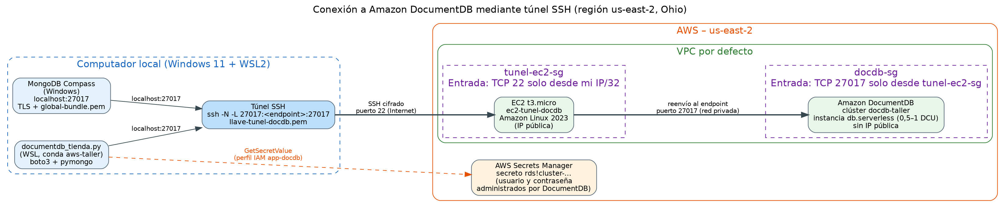
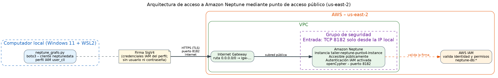
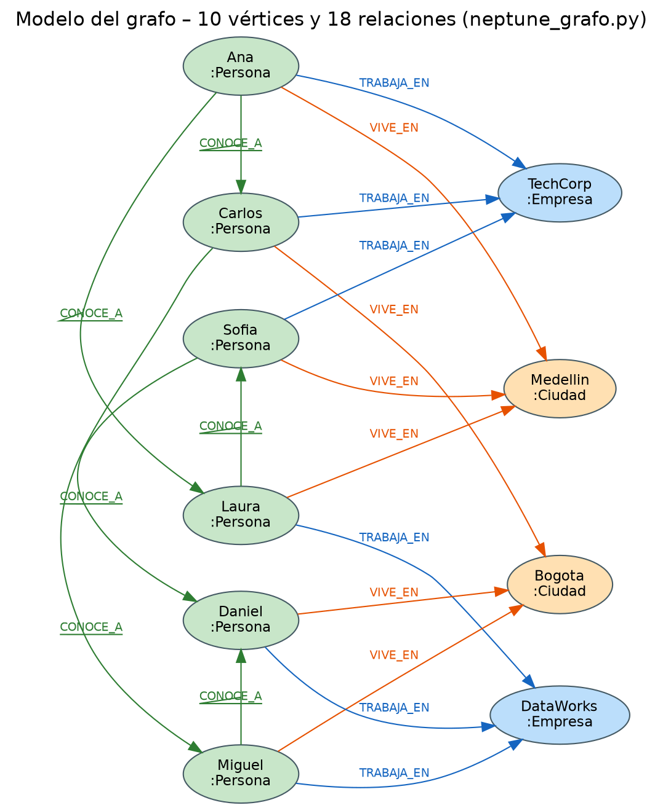

# AWS Data Services Lab

### Gestión de secretos, infraestructura como código y bases de datos administradas en AWS
*Proyecto académico — Ingeniería de Datos, Universidad EIA (2026-2)*


Este repositorio reúne seis prácticas sobre servicios de datos en Amazon Web Services. Cada una despliega un servicio con la configuración de menor costo posible, lo conecta desde Python o desde la línea de comandos y documenta su arquitectura, seguridad, costos y eliminación. El hilo conductor es **no escribir credenciales en el código**: las contraseñas de bases de datos se administran con **AWS Secrets Manager** y los servicios que no usan contraseña se autentican con **IAM**.

---

## Tabla de contenido

- [Alcance](#alcance)
- [Estructura del repositorio](#estructura-del-repositorio)
- [Requisitos previos](#requisitos-previos)
- [Modelo de seguridad y autenticación](#modelo-de-seguridad-y-autenticación)
- [Punto 1 — AWS Secrets Manager](#punto-1--aws-secrets-manager)
- [Punto 2 — Despliegue con Terraform, Boto3 y AWS CLI](#punto-2--despliegue-con-terraform-boto3-y-aws-cli)
- [Punto 3 — Amazon DocumentDB](#punto-3--amazon-documentdb)
- [Punto 4 — Amazon Neptune](#punto-4--amazon-neptune)
- [Punto 5 — Amazon Redshift](#punto-5--amazon-redshift)
- [Punto 6 — AWS Glue Data Catalog y Amazon Athena](#punto-6--aws-glue-data-catalog-y-amazon-athena)
- [Resumen de costos](#resumen-de-costos)
- [Limpieza de recursos](#limpieza-de-recursos)
- [Tecnologías](#tecnologías)
- [Contexto académico](#contexto-académico)

---

## Alcance

| Punto | Servicio | Qué se demuestra | Acceso desde local |
|:---:|---|---|---|
| 1 | AWS Secrets Manager | Crear, recuperar y actualizar un secreto con mínimo privilegio | Boto3 + perfil IAM |
| 2 | VPC, S3, EC2, RDS MySQL | Mismo despliegue con Terraform, Boto3 y AWS CLI; contraseña de RDS administrada | Usuario IAM `user_cli` |
| 3 | Amazon DocumentDB | Clúster Serverless, túnel SSH, TLS y consultas con PyMongo | Túnel SSH vía EC2 |
| 4 | Amazon Neptune | Grafo de propiedades con openCypher y recorridos desde Python | Punto de acceso público + IAM (SigV4) |
| 5 | Amazon Redshift Serverless | Carga con `COPY` desde S3 y consultas analíticas con la Data API | Redshift Data API |
| 6 | AWS Glue + Athena | Descubrimiento de esquema con crawler y consultas SQL sobre S3 | Consola / permisos IAM |

Todos los recursos se desplegaron en una sola región, **us-east-2 (Ohio)**, y se eliminaron al terminar cada práctica.

---

## Estructura del repositorio

```
.
├── README.md
├── .gitignore
├── Actividad AWS.pdf                       # Enunciado de la actividad
│
├── punto1_secrets_manager/
│   ├── leer_secreto.py                     # Lectura del secreto con Boto3
│   └── politica_lector_secreto.json        # Política IAM de solo lectura sobre un secreto
│
├── punto2_terraform_sdk_cli/
│   ├── terraform/
│   │   ├── provider.tf                     # Proveedor AWS, región y perfil user_cli
│   │   └── main.tf                         # VPC, subredes, SG, S3, EC2 y RDS
│   ├── boto3/
│   │   ├── deploy.py                       # Despliegue con el SDK
│   │   └── destroy.py                      # Eliminación con el SDK
│   ├── cli/
│   │   └── comandos.md                     # Creación y eliminación con AWS CLI
│   └── iam/
│       └── policy-user-cli.json            # Permisos del usuario user_cli
│
├── punto3_documentdb/
│   ├── documentdb_tienda.py                # Inserción, filtro, ordenación y agregación
│   ├── politica_app_docdb.json             # Lectura del secreto administrado del clúster
│   └── diagrama_conexion_documentdb.png
│
├── punto4_neptune/
│   ├── neptune_grafo.py                    # Creación del grafo y consultas desde Python
│   ├── consultas.cypher                    # Instrucciones openCypher del grafo
│   ├── modelo_grafo.png
│   └── arquitectura_acceso_neptune.png
│
├── punto5_redshift/
│   ├── datos/
│   │   ├── clientes.csv                    # 12 clientes
│   │   └── pedidos.csv                     # 40 pedidos (enero a junio de 2026)
│   ├── redshift_carga_consultas.py         # S3 → COPY → consultas con la Data API
│   ├── consultas.sql                       # DDL, COPY y consultas analíticas
│   ├── rol_redshift_confianza.json         # Confianza del rol que usa Redshift
│   ├── rol_redshift_permisos_s3.json       # Lectura del bucket para COPY
│   └── politica_app_redshift.json          # Permisos mínimos del programa Python
│
└── punto6_glue_athena/
    ├── datos/
    │   └── ventas.csv                      # 20 registros iniciales + 5 agregados
    └── consultas.sql                       # Consultas de Athena
```

> Las evidencias de creación, prueba y eliminación de recursos (capturas de pantalla) se presentan en el informe de la actividad y no se versionan en este repositorio. En ellas se ocultaron el número de cuenta, las direcciones IP y cualquier valor sensible.

---

## Requisitos previos

| Herramienta | Uso |
|---|---|
| Windows 11 + WSL2 (Ubuntu) | Entorno de trabajo |
| AWS CLI v2 | Operaciones desde terminal y validación de identidades |
| Conda (entorno `aws-taller`, Python 3.11) | Ejecución de los programas |
| Terraform (proveedor `hashicorp/aws ~> 6.0`) | Infraestructura como código (Punto 2) |
| MongoDB Compass | Cliente gráfico de DocumentDB (Punto 3) |
| Cuenta de AWS con un usuario administrador IAM | Creación de recursos (nunca con la cuenta raíz) |

### Instalación del entorno

```bash
# AWS CLI v2
curl "https://awscli.amazonaws.com/awscli-exe-linux-x86_64.zip" -o "awscliv2.zip"
unzip awscliv2.zip && sudo ./aws/install
aws --version

# Entorno de Python
conda create -n aws-taller python=3.11 -y
conda activate aws-taller
pip install boto3 pymongo
```

### Perfiles de AWS CLI

Cada programa usa un perfil propio. Los perfiles se configuran localmente y sus llaves quedan en `~/.aws/credentials`, **fuera del repositorio**:

```bash
aws configure --profile <nombre-del-perfil>
aws sts get-caller-identity --profile <nombre-del-perfil>
```

| Perfil | Usuario IAM | Puntos | Permisos |
|---|---|---|---|
| `lector-secreto` | `app_lector_secreto` | 1 | `secretsmanager:GetSecretValue` sobre un único secreto |
| `user_cli` | `user_cli` | 2 y 4 | Creación y eliminación de infraestructura (Punto 2) y acceso a datos de Neptune (Punto 4) |
| `app-docdb` | `app_docdb` | 3 | `secretsmanager:GetSecretValue` sobre el secreto del clúster DocumentDB |
| `app-redshift` | `app_redshift` | 5 | Subida a S3, Data API sobre un workgroup y lectura de su secreto |

La creación y eliminación de la infraestructura de los puntos 3 y 5 se hizo desde **AWS CloudShell** con un usuario administrador IAM, de modo que ninguna llave con privilegios elevados quedó guardada en el equipo local.

---

## Modelo de seguridad y autenticación

| Principio | Cómo se aplicó |
|---|---|
| Sin contraseñas en el código | Los programas recuperan las credenciales de Secrets Manager en tiempo de ejecución o le pasan a AWS el ARN del secreto. |
| Administración integrada | RDS (`manage_master_user_password`), DocumentDB (`--manage-master-user-password`) y Redshift Serverless (`--manage-admin-password`) generan y custodian su propia contraseña en Secrets Manager. |
| Mínimo privilegio | Los usuarios de las aplicaciones solo pueden ejecutar la acción necesaria sobre el recurso exacto (ARN específico). |
| Llaves IAM fuera de Secrets Manager | Las herramientas necesitan autenticarse en AWS **antes** de leer un secreto; las llaves de acceso viven en perfiles locales. |
| Servicios sin contraseña | Neptune, Glue y Athena se autentican solo con IAM; por eso no se creó ningún secreto para ellos. |
| Red restringida | RDS, DocumentDB y Redshift sin acceso público; los grupos de seguridad solo admiten la IP pública del equipo (`/32`) o el grupo de seguridad de otro recurso. |
| Cifrado en tránsito | DocumentDB con TLS y el certificado de AWS; Neptune y Redshift Data API con HTTPS y firma SigV4. |

### Archivos que nunca se publican

El `.gitignore` excluye estado de Terraform, llaves y credenciales:

```gitignore
.terraform/
*.tfstate
*.tfstate.*
*.tfvars
.terraform.lock.hcl
*.pem
*.key
.env
credentials
config
```

Los ARN y nombres de recursos que aparecen en el código y en las políticas usan el marcador `<ACCOUNT_ID>` en lugar del número de cuenta, y los valores que dependen de cada despliegue (bucket, ARN de secretos, endpoints) deben reemplazarse antes de ejecutar.

---

## Punto 1 — AWS Secrets Manager

**Objetivo:** guardar un usuario y una contraseña ficticios en Secrets Manager, leerlos desde Python con un usuario que solo puede acceder a ese secreto, y comprobar que una actualización del valor se refleja sin cambiar el código.

**Flujo**

1. Crear el secreto `taller-aws/punto1/credenciales-prueba` con las claves `username` y `password`, cifrado con la llave administrada `aws/secretsmanager`.
2. Crear el usuario IAM `app_lector_secreto` con la política [`politica_lector_secreto.json`](./punto1_secrets_manager/politica_lector_secreto.json), que solo permite `secretsmanager:GetSecretValue` sobre el ARN del secreto.
3. Ejecutar el programa:

```bash
cd punto1_secrets_manager
python leer_secreto.py
```

4. Actualizar el valor del secreto y volver a ejecutar el programa sin modificarlo.

**Resultado:** el programa muestra un `VersionId` distinto y el nuevo usuario. Secrets Manager crea una versión nueva con la etiqueta `AWSCURRENT` y conserva la anterior como `AWSPREVIOUS`. La contraseña se imprime enmascarada.

**Verificación de mínimo privilegio**

```bash
aws secretsmanager list-secrets --profile lector-secreto   # → AccessDeniedException
```

---

## Punto 2 — Despliegue con Terraform, Boto3 y AWS CLI

**Objetivo:** desplegar la misma infraestructura con tres herramientas distintas, de forma secuencial, eliminando cada versión antes de iniciar la siguiente.

**Infraestructura desplegada en cada versión**

| Recurso | Configuración |
|---|---|
| VPC | Red propia por versión: `10.0.0.0/16` (Terraform), `10.1.0.0/16` (Boto3), `10.2.0.0/16` (CLI) |
| Subredes | Dos subredes privadas en zonas de disponibilidad distintas (requisito del grupo de subredes de RDS) |
| Grupo de seguridad | Uno compartido por la EC2 y RDS, sin reglas de entrada abiertas a internet |
| S3 | Bucket `taller-aws-p2-<ACCOUNT_ID>-tf`, `-boto3` o `-cli` según la herramienta |
| EC2 | `t3.micro` con Amazon Linux 2023 |
| RDS | MySQL `db.t3.micro`, 20 GB gp3, sin acceso público, sin snapshot final |
| Contraseña de RDS | Administrada por Secrets Manager (`manage_master_user_password = true`) |

**Autenticación:** las tres herramientas usan el perfil `user_cli`, cuyos permisos se documentan en [`policy-user-cli.json`](./punto2_terraform_sdk_cli/iam/policy-user-cli.json).

| Herramienta | Cómo usa el perfil |
|---|---|
| Terraform | `profile = "user_cli"` en el bloque `provider "aws"` de [`provider.tf`](./punto2_terraform_sdk_cli/terraform/provider.tf) |
| Boto3 | `boto3.Session(profile_name="user_cli")` |
| AWS CLI | `--profile user_cli` en cada comando |

**Terraform**

```bash
cd punto2_terraform_sdk_cli/terraform
terraform init
terraform plan
terraform apply
terraform destroy
```

Gracias a `manage_master_user_password`, la contraseña de RDS **no queda escrita en los archivos `.tf` ni en `terraform.tfstate`**; el estado solo guarda la referencia al secreto.

**Boto3**

```bash
cd punto2_terraform_sdk_cli/boto3
python deploy.py     # crea VPC, subredes, SG, S3, EC2 y RDS, y muestra el ARN del secreto de RDS
python destroy.py    # elimina RDS, grupo de subredes, EC2, SG, subredes, VPC y bucket
```

**AWS CLI:** los comandos de creación y eliminación, en orden, están en [`comandos.md`](./punto2_terraform_sdk_cli/cli/comandos.md).

**Comparación de métodos**

| Método | Ventajas | Desventajas | Uso más adecuado |
|---|---|---|---|
| Terraform | Declarativo, reproducible; crea y elimina todo con `apply` y `destroy` y resuelve las dependencias | Requiere manejar el archivo de estado y aprender HCL | Ambientes completos y repetibles |
| Boto3 | Flexible e integrable con lógica de programación | Más código; el orden de creación y eliminación se controla a mano | Automatizaciones personalizadas |
| AWS CLI | Rápido y directo | Difícil de mantener con muchas dependencias; las variables viven solo en la sesión | Pruebas y tareas puntuales |

---

## Punto 3 — Amazon DocumentDB

**Objetivo:** desplegar DocumentDB con el menor costo posible, conectarlo desde el equipo local a través de un túnel SSH y ejecutar consultas con PyMongo usando la contraseña administrada por Secrets Manager.

**Configuración desplegada**

| Componente | Valor |
|---|---|
| Clúster | `docdb-taller`, motor 5.0.0 |
| Instancia | `db.serverless`, capacidad 0,5–1 DCU |
| Contraseña | Administrada por Secrets Manager (`rds!cluster-…`) |
| Red | VPC por defecto, grupo de subredes en us-east-2a/b/c |
| Grupo de seguridad del clúster | `docdb-sg`: TCP 27017 solo desde `tunel-ec2-sg` |
| EC2 del túnel | `t3.micro`, Amazon Linux 2023, `tunel-ec2-sg`: TCP 22 solo desde la IP local |

**Arquitectura de conexión**



**Reproducción**

```bash
cd punto3_documentdb

# 1. Certificado público de AWS para TLS (no se versiona: *.pem está en .gitignore)
curl -o global-bundle.pem https://truststore.pki.rds.amazonaws.com/global/global-bundle.pem

# 2. Túnel SSH (terminal dedicada)
ssh -i ~/.ssh/llave-tunel-docdb.pem -N \
  -L 27017:<endpoint-del-cluster>:27017 \
  ec2-user@<dns-publico-ec2>

# 3. Programa (otra terminal)
python documentdb_tienda.py
```

Parámetros de conexión relevantes: `tls=True`, `tlsCAFile=global-bundle.pem`, `tlsAllowInvalidHostnames=True` (el certificado corresponde al endpoint y la conexión llega a `localhost`), `directConnection=True` y `retryWrites=False` (DocumentDB no admite escrituras reintentables).

**Consultas sobre `tienda.productos` (10 documentos)**

| Consulta | Operación | Resultado |
|---|---|---|
| Filtro | Tecnología con precio > $200.000 | Portátil, monitor y audífonos |
| Ordenación | Productos de Medellín por precio descendente | 4 productos, de $3.200.000 a $32.000 |
| Agregación | `$group` por categoría con conteo, stock total y precio promedio | Alimentos lidera en stock (140); Tecnología en precio promedio ($1.158.750) |

**Decisión de capacidad:** Serverless con 0,5 DCU (≈ USD 0,041/h) resultó más económico que la instancia aprovisionada más pequeña, `db.t4g.medium` (USD 0,076/h), para una práctica corta con carga mínima.

---

## Punto 4 — Amazon Neptune

**Objetivo:** desplegar Neptune con bajo costo, crear un grafo de propiedades y ejecutar desde Python consultas que recorran relaciones, evaluando alternativas de acceso desde el equipo local.

**Acceso elegido: punto de acceso público con autenticación IAM.** A partir de la versión 1.4.6 del motor, Neptune puede exponer un endpoint público siempre que la autenticación IAM esté activada. Esto evita crear una EC2 para un túnel SSH. La protección descansa en dos capas: el grupo de seguridad limita el origen al puerto 8182 desde la IP local, y cada solicitud debe estar firmada (SigV4) por una identidad IAM con permisos sobre el clúster. Por esta razón Neptune no requiere ningún secreto en Secrets Manager.



**Modelo del grafo:** 10 vértices y 18 relaciones.

| Elemento | Detalle |
|---|---|
| Vértices `:Persona` | Ana, Carlos, Laura, Miguel, Sofia, Daniel |
| Vértices `:Empresa` | TechCorp, DataWorks |
| Vértices `:Ciudad` | Medellin, Bogota |
| Relaciones `TRABAJA_EN` | 6 (Persona → Empresa) |
| Relaciones `VIVE_EN` | 6 (Persona → Ciudad) |
| Relaciones `CONOCE_A` | 6 (Persona → Persona) |



**Reproducción**

```bash
cd punto4_neptune
# Reemplazar ENDPOINT en neptune_grafo.py por el endpoint de la instancia (puerto 8182)
python neptune_grafo.py
```

El programa usa el cliente `neptunedata` de Boto3, que firma cada solicitud con las credenciales del perfil `user_cli`. Los vértices y relaciones se crean con `MERGE`, por lo que el programa puede ejecutarse varias veces sin duplicar datos. Las mismas instrucciones están en [`consultas.cypher`](./punto4_neptune/consultas.cypher).

**Consultas de recorrido (openCypher)**

| Consulta | Patrón | Resultado |
|---|---|---|
| Empleados de TechCorp | `(p:Persona)-[:TRABAJA_EN]->(e:Empresa {nombre:'TechCorp'})` | Ana, Carlos y Sofia |
| Residentes de Medellín | `(p:Persona)-[:VIVE_EN]->(c:Ciudad {nombre:'Medellin'})` | Ana, Laura y Sofia |
| Contactos de segundo nivel | `(Ana)-[:CONOCE_A]->(b)-[:CONOCE_A]->(c)` | Ana → Carlos → Miguel · Ana → Laura → Sofia |

---

## Punto 5 — Amazon Redshift

**Objetivo:** cargar dos tablas relacionadas desde S3 hacia Redshift con `COPY` y ejecutar consultas con filtro, unión y agregación mediante la **Redshift Data API**, autenticando con el secreto administrado en Secrets Manager.

**Configuración desplegada**

| Componente | Valor |
|---|---|
| Namespace | `taller-ns`, base de datos `tienda`, usuario `adminrs` |
| Contraseña | Administrada por Secrets Manager (`--manage-admin-password`, secreto `redshift!…`) |
| Workgroup | `taller-wg`, capacidad base de **4 RPU** (mínimo), sin acceso público |
| Rol para COPY | `RedshiftLecturaS3Punto5`, rol por defecto del namespace (`IAM_ROLE default`) |
| Control de costos | Límite de uso de 2 RPU-horas diarias con acción `deactivate` |

**Modelo de datos**

| Tabla | Filas | Diseño físico |
|---|:---:|---|
| `clientes` | 12 | `DISTSTYLE ALL` (dimensión pequeña replicada en todos los nodos) |
| `pedidos` | 40 | `DISTKEY (id_cliente)` y `SORTKEY (fecha_pedido)` |

**Flujo del programa** [`redshift_carga_consultas.py`](./punto5_redshift/redshift_carga_consultas.py)

1. Sube los CSV de [`datos/`](./punto5_redshift/datos) a `s3://<bucket>/punto5/`.
2. Crea las tablas y carga los datos con `COPY ... IAM_ROLE default FORMAT AS CSV IGNOREHEADER 1`.
3. Envía cada instrucción con `execute_statement` (workgroup, base de datos y `SecretArn`), espera con `describe_statement` hasta `FINISHED` y recupera las filas con `get_statement_result`.

```bash
cd punto5_redshift
# Reemplazar BUCKET y SECRET_ARN en el programa por los valores del despliegue
python redshift_carga_consultas.py
```

**Permisos del programa** ([`politica_app_redshift.json`](./punto5_redshift/politica_app_redshift.json)): `s3:PutObject` solo en `punto5/*`, `redshift-data:ExecuteStatement` solo sobre el workgroup, lectura de estado y resultados, y `secretsmanager:GetSecretValue` solo sobre el secreto del namespace.

**Consultas** ([`consultas.sql`](./punto5_redshift/consultas.sql))

| Consulta | Pregunta | Resultado clave |
|---|---|---|
| Filtro | ¿Qué pedidos del primer trimestre superaron $1.000.000? | 6 de 14 pedidos; el mayor, $14.700.000 (Tecnología) |
| Unión | ¿Qué compraron los clientes de Medellín? | 9 pedidos; Andrés Restrepo es el cliente más frecuente (6) |
| Agregación | ¿Cuánto se vendió por ciudad? | Barranquilla lidera ($18.090.000), impulsada por un solo pedido; Bogotá tiene más pedidos (11) pero el ticket promedio más bajo |

**Decisión de capacidad:** Serverless solo cobra mientras ejecuta consultas. La vista `sys_serverless_usage` registró **122 segundos activos y 960 RPU-segundos facturados** (por el mínimo de 60 segundos por activación), es decir, **≈ USD 0,096** a USD 0,36 por RPU-hora en Ohio, frente a ≈ USD 0,50 de un nodo `dc2.large` encendido durante las dos horas de la práctica.

**Redshift frente a RDS:** Redshift es un almacén de datos columnar orientado a consultas analíticas sobre grandes volúmenes (OLAP); RDS es una base relacional orientada a transacciones (OLTP). Un tablero de ventas históricas encaja en Redshift; el registro de pedidos de una tienda en línea, en RDS.

---

## Punto 6 — AWS Glue Data Catalog y Amazon Athena

**Objetivo:** catalogar un archivo almacenado en S3 con un crawler de Glue, corregir el esquema inferido y consultarlo con SQL desde Athena.

**Flujo**

1. Cargar [`ventas.csv`](./punto6_glue_athena/datos/ventas.csv) (columnas `id`, `producto`, `categoria`, `cantidad`, `precio`, `ciudad`) en un bucket de S3.
2. Crear la base de datos `taller_punto6_db` en Glue Data Catalog y un crawler que genera la tabla `taller_aws_punto6_sgf`.
3. Revisar y corregir el esquema inferido.
4. Consultar la tabla desde Athena con un filtro y una agrupación ([`consultas.sql`](./punto6_glue_athena/consultas.sql)).
5. Agregar 5 registros (`id` 21 a 25), volver a ejecutar el crawler y verificar los nuevos datos.

**Consultas de Athena**

| Consulta | Operación |
|---|---|
| Filtro | Ventas de la ciudad de Medellín |
| Agrupación | Unidades vendidas por categoría (`SUM(cantidad)`), de mayor a menor |
| Verificación | Conteo total de registros y registros con `id > 20` después de actualizar el catálogo |

**Datos frente a metadatos:** los archivos permanecen en S3; Glue Data Catalog solo guarda su descripción (columnas, tipos, formato y ubicación). Athena combina ambos para consultar los archivos directamente con SQL.

**Credenciales:** el punto se resolvió únicamente con S3, Glue y Athena mediante permisos IAM, por lo que no se requirió ningún secreto en Secrets Manager.

---

## Resumen de costos

Estimaciones para el tiempo real de uso de cada práctica en us-east-2. Los cálculos detallados están en el informe.

| Punto | Componentes facturables principales | Costo |
|:---:|---|---|
| 1 | 1 secreto (prorrateado) y llamadas a la API | < USD 0,01 |
| 2 | EC2 t3.micro, RDS db.t3.micro, almacenamiento, S3 y secreto de RDS | ≈ USD 0,03 por hora |
| 3 | DocumentDB Serverless 0,5 DCU, EC2 t3.micro del túnel, IPv4 pública, EBS y secreto | ≈ USD 0,17 (3 h) |
| 4 | Instancia Neptune, almacenamiento e IPv4 pública | Ver informe |
| 5 | Cómputo Redshift Serverless (960 RPU-segundos medidos), almacenamiento, S3 y secreto | ≈ USD 0,10 |
| 6 | Ejecuciones del crawler, catálogo, S3 y datos examinados por Athena | Ver informe |

**Lecciones de costo**

- Serverless no siempre es más barato: depende del mínimo facturable de cada servicio (0,5 DCU en DocumentDB, 4 RPU con 60 s mínimos por activación en Redshift).
- Las instancias aprovisionadas, las IP públicas y el almacenamiento se cobran aunque no haya tráfico.
- Una EC2 auxiliar olvidada (túnel) puede costar más en un mes que toda la práctica.
- En Athena el costo depende del volumen de datos examinado; filtros, particiones y formatos columnares lo reducen.

---

## Limpieza de recursos

Al finalizar cada punto se eliminaron todos los recursos y se verificó que no quedaran componentes facturables. Las capturas de esta verificación se incluyen en el informe.

| Recurso | Comando de verificación |
|---|---|
| Instancias RDS | `aws rds describe-db-instances` |
| Clústeres DocumentDB | `aws docdb describe-db-clusters` |
| Clústeres Neptune | `aws neptune describe-db-clusters --query "DBClusters[?Engine=='neptune']"` |
| Redshift Serverless | `aws redshift-serverless list-workgroups` · `list-namespaces` · `list-snapshots` |
| Snapshots | `aws rds describe-db-snapshots` · `aws docdb describe-db-cluster-snapshots` |
| Instancias EC2 | `aws ec2 describe-instances --filters Name=instance-state-name,Values=running` |
| Volúmenes EBS sueltos | `aws ec2 describe-volumes --filters Name=status,Values=available` |
| Buckets S3 | `aws s3 ls` |
| Secretos | `aws secretsmanager list-secrets` |
| Roles y usuarios IAM de las aplicaciones | `aws iam get-role` · `aws iam get-user` (→ `NoSuchEntity`) |

**Orden de eliminación aplicado:** instancias de base de datos → clúster o namespace (sin snapshot final) → EC2 auxiliares → grupos de subredes → grupos de seguridad (primero los que referencian a otros) → subredes y VPC propias → buckets → pares de llaves → roles y usuarios IAM de las aplicaciones.

---

## Tecnologías

| Categoría | Herramientas |
|---|---|
| Nube | AWS (us-east-2): Secrets Manager, IAM, VPC, EC2, S3, RDS (MySQL), DocumentDB, Neptune, Redshift Serverless, Glue, Athena, CloudShell |
| Infraestructura | Terraform, AWS CLI v2, Boto3 |
| Lenguajes | Python 3.11, SQL, openCypher, consultas MongoDB, HCL |
| Librerías | `boto3`, `pymongo` |
| Clientes | MongoDB Compass, Redshift Query Editor v2, consola de Athena |
| Entorno | Windows 11, WSL2 (Ubuntu), Conda, VS Code |

---

## Contexto académico

Actividad del curso **Ingeniería de Datos** de la **Universidad EIA**, periodo **2026-2**. La actividad evalúa la gestión segura de credenciales, el despliegue de infraestructura con distintos métodos y el uso de servicios administrados de bases de datos documentales, de grafos, analíticas y de catálogo de datos, con énfasis en la estimación y el control de costos.

**Autores**

- Juan José Jaramillo Mora — [@Juanjo1414](https://github.com/Juanjo1414)
- Sebastián Giraldo Franco — [@sebasgiraldo69](https://github.com/sebasgiraldo69)